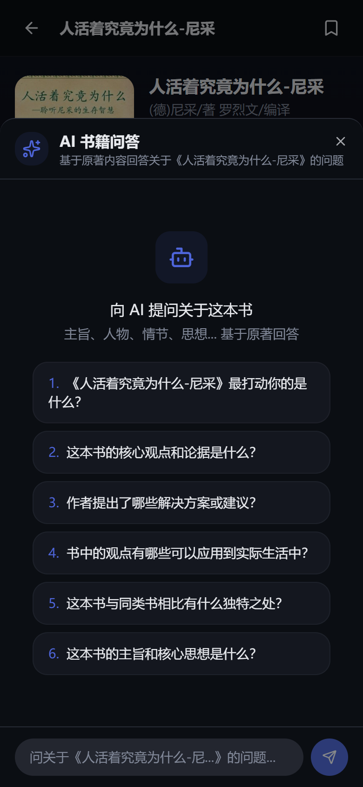
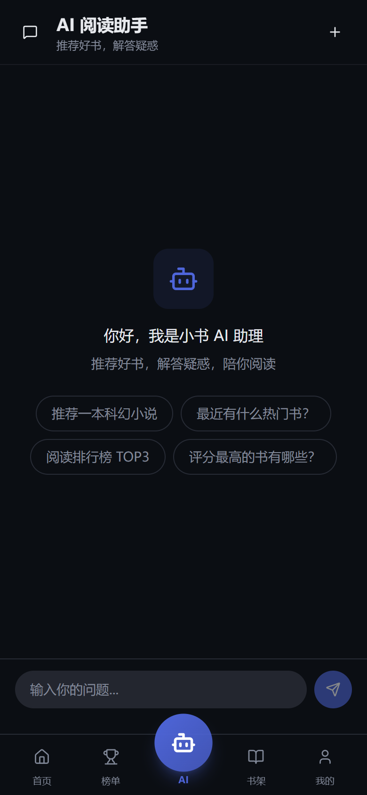
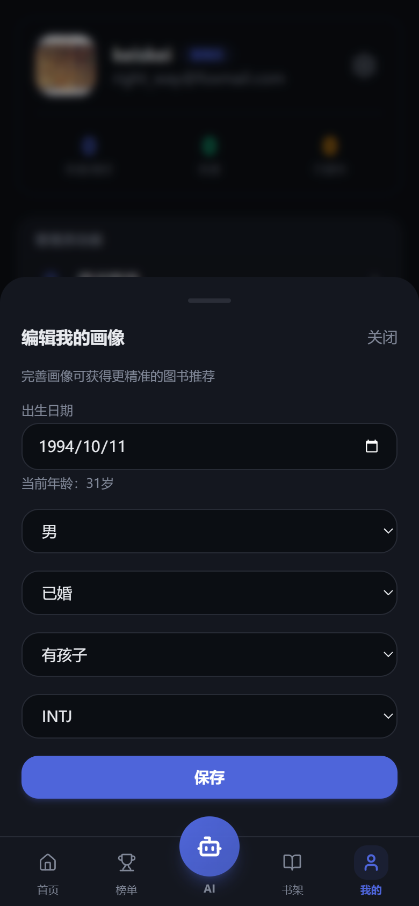

<p align="center">
  
</p>

<h1 align="center">KBook</h1>

<p align="center">
  <strong>为「此刻的你」找到那本书</strong>
</p>

<p align="center">
  智能问答 · 向量检索 · 个性推荐
</p>

<p align="center">
  
  
  
  
  
</p>

<p align="center">
  <a href="./README.md">中文</a> · <a href="./README_EN.md">English</a>
</p>

---

## ✨ 为「此刻的你」找到那本书

30 岁未婚的 INTJ 与 35 岁二孩的 ESFJ，注定不该读到同一本「人生指南」。

KBook 基于真实人生状态（年龄 / 婚姻 / 育儿 / MBTI）构建推荐引擎，让每本书都精准对应当下的人生课题。更关键的是，我们不做「读完即走」的浅层阅读——KBook 将整本书籍内容完整注入 RAG 向量知识库，让 AI 真正「读过」这本书，再陪你聊透每一个细节：

- 📖 **穿透式追问** — 「作者第三章的论据在第五章被自我推翻了，你怎么看？」AI 能跨章节检索，带你看清论证脉络
- 🧠 **苏格拉底式对谈** — 不直接给答案，而是用书中的思想框架向你层层提问，逼出你自己的独立思考
- 🔗 **知识图谱编织** — 让 AI 对比你书架里的其他书籍，发现跨书的隐藏关联，构建属于你的认知网络
- ✍️ **观点压力测试** — 抛出与作者相左的学界观点，看 AI 如何替你拆解辩论双方的逻辑漏洞

**在 KBook，书不是被读完的，是被聊透的。**

---

### AI 图书问答技术实现

- 🔍 **RAG 精准检索** — 全书内容自动分块、向量化存入 Qdrant，提问时毫秒级召回最相关的原文片段
- 🤖 **基于原著的回答** — AI 严格依据检索到的书籍内容作答，不编造、不臆测，每段回答都有原文可循
- 💡 **智能推荐问题** — 根据书籍标签自动生成个性化问题（小说类：人物关系 / 情节转折；非虚构类：核心论点 / 实践建议）
- 🔄 **多轮流式对话** — SSE 流式输出，就一本书展开深度多轮讨论，越问越深入
- 🎯 **质量门控** — 仅评分达标的优质图书才生成内容向量，确保问答质量

---

## 预览

<table>
  <tr>
    <td align="center"><b>📚 图书详情 & AI 问答</b></td>
    <td align="center"><b>🎯 个性推荐</b></td>
    <td align="center"><b>👤 个人画像</b></td>
  </tr>
  <tr>
    <td></td>
    <td></td>
    <td></td>
  </tr>
</table>

---

## Features

### 🤖 AI 智能引擎

- **AI 图书问答** — 针对单本书全量内容的 RAG 向量检索问答，自动生成推荐问题，基于原著片段精准回答
- **AI 伴读助手** — 基于 LangChain4j 的多轮流式对话，支持 @Tool 调用（搜索图书 / 查书架 / 查进度）
- **AI 元数据生成** — 自动提取标签、评分、八维度相关度（年龄段 / 性别 / 婚姻 / 子女 / MBTI）
- **Vision OCR** — 扫描版 PDF 自动调用大模型视觉能力逐页识别
- **多模型支持** — 管理后台可配置多个 AI 提供商（Ollama / OpenAI / DeepSeek 等），一键切换

### 📖 沉浸阅读

- **多格式引擎** — EPUB / PDF / TXT 三格式统一引擎，字体、字号、行距、主题色自由调节
- **进度同步** — 实时上报 + 离线批量同步，时间戳覆盖冲突解决，跨设备无缝衔接
- **TTS 朗读** — 文本分片语音合成，播放/暂停/停止一键操控

### 🎯 个性推荐

- **用户画像** — 注册采集 + 运行时更新，构建多维阅读画像
- **向量召回** — Qdrant 存储图书元数据向量，基于用户画像余弦相似度召回
- **协同过滤** — 基于阅读 / 收藏 / 评分 / 完成行为加权，推荐相似用户喜爱的书籍
- **融合排序** — 向量召回 + 协同过滤 + 热门兜底，多路融合排序

### 💬 社区互动

- **书评系统** — 书籍 / 章节级评论，嵌套回复、点赞、收藏
- **关注体系** — 关注 / 粉丝体系，用户主页展示在读 / 已读 / 书评
- **消息通知** — 评论回复、点赞里程碑等阶梯式推送

### ⚙️ 管理后台

- **目录扫描** — SSE 流式扫描本地 EPUB / PDF / TXT 目录，自动解析入库
- **文件上传** — 手动上传图书文件，自动解析元数据 + AI 标签生成
- **重新解析** — 一键重新提取图书元数据（作者 / 简介 / 封面 / 目录）
- **AI 模型管理** — 多提供商 CRUD、连接测试、一键启用 / 禁用
- **用户审核** — 邀请注册制，管理员审核 / 批量操作 / 封禁 / 解封

---

## Architecture

```
kbook/
├── frontend/                # React 19 + TypeScript + Vite
│   ├── src/
│   │   ├── components/      # UI 组件
│   │   │   ├── auth/        # 路由守卫（AuthGuard / AdminGuard / GuestGuard）
│   │   │   ├── book/        # 图书组件（BookChatSheet / AI 问答面板）
│   │   │   ├── layout/      # 布局（TabBar / AppLayout / BlankLayout）
│   │   │   ├── reader/      # 阅读器组件（EpubRenderer / PdfRenderer / TxtRenderer / TtsFloatPlayer）
│   │   │   └── ui/          # shadcn/ui 基础组件
│   │   ├── pages/           # 页面
│   │   │   ├── home/        # 首页（统计 / 推荐 / 榜单 / 分类）
│   │   │   ├── rank/        # 排行榜（阅读 / 评分 / 新书）
│   │   │   ├── ai/          # AI 助理（多轮对话）
│   │   │   ├── bookshelf/   # 书架
│   │   │   ├── book/        # 图书详情 + AI 问答入口
│   │   │   ├── reader/      # 阅读器（EPUB / PDF / TXT）
│   │   │   ├── search/      # 搜索（ES 全文检索）
│   │   │   ├── reviews/     # 书评
│   │   │   ├── follow/      # 关注 / 粉丝
│   │   │   ├── notifications/ # 消息通知
│   │   │   ├── profile/     # 个人中心 / 阅读历史
│   │   │   ├── user/        # 用户主页
│   │   │   ├── admin/       # 管理后台（审核 / 图书 / AI 配置）
│   │   │   └── auth/        # 登录 / 注册 / 重置密码
│   │   ├── router/          # 路由配置（懒加载 + 守卫）
│   │   ├── store/           # Zustand 状态管理
│   │   ├── api/             # API 接口层
│   │   ├── types/           # TS 类型定义
│   │   └── utils/           # 工具函数（Axios 封装）
│   └── vite.config.ts       # PWA + 代理配置
│
├── backend/                 # Spring Boot 3.4
│   └── src/main/java/com/kbook/
│       ├── common/          # 统一响应、分页、异常处理
│       ├── config/          # Security / JWT / CORS / Redis / Qdrant / LangChain4j
│       ├── controller/      # REST API 控制器
│       ├── document/        # Elasticsearch 文档定义
│       ├── entity/          # JPA 实体
│       ├── repository/      # 数据访问层
│       └── service/         # 业务逻辑层
│
└── deploy/                  # 部署配置
    ├── docker-compose.yml   # 全栈容器编排
    └── nginx/               # Nginx 反向代理配置
```

---

## Tech Stack

### Frontend

| Tech | Version | Purpose |
|------|---------|---------|
| React + TypeScript | 19 / 5 | UI Framework |
| Vite | 7 | Build Tool |
| Tailwind CSS + shadcn/ui | 3.4 | Styling & Components |
| React Router DOM | 7 | Routing |
| Zustand | 5 | State Management |
| Axios | 1.x | HTTP Client (Interceptor + Token Refresh) |
| epubjs | 0.3.93 | EPUB Renderer |
| pdfjs-dist | 5.x | PDF Renderer |
| Lucide React | — | Icon Library |
| vite-plugin-pwa | — | PWA Offline Support |

### Backend

| Tech | Version | Purpose |
|------|---------|---------|
| Spring Boot | 3.4 | Application Framework |
| Java | 17 | Runtime |
| Spring Security + JWT | — | Stateless Auth |
| Spring Data JPA + Hibernate | — | ORM |
| LangChain4j | 1.13 | AI Chat / RAG / Embedding |
| epublib-core | 3.1 | EPUB Parsing |
| Apache PDFBox | — | PDF Parsing / Rendering / OCR |
| Maven | — | Build Tool |

### Infrastructure

| Component | Tech | Purpose |
|-----------|------|---------|
| RDBMS | MySQL 8 + HikariCP | Primary Data Store |
| Cache | Redis 7 (Lettuce) | Captcha / Session / Recommendation Cache |
| Search | Elasticsearch 8.12 | Full-Text Search / Highlight / Suggestion |
| Vector DB | Qdrant v1.12 | Book Metadata Vectors + RAG Content Vectors |
| Mail | QQ SMTP (SSL 465) | Captcha / Invitation / Notification |
| Reverse Proxy | Nginx (Alpine) | SSL / Compression / Rate Limit / SSE / Static |
| Container | Docker Compose | Full-Stack Deployment |

---

## How AI Book Q&A Works

```
┌──────────┐     ┌──────────────┐     ┌─────────────────┐     ┌─────────────┐
│  用户提问  │ ──▶ │ Embedding 向量化 │ ──▶ │ Qdrant 相似度检索 │ ──▶ │ LLM 生成回答  │
└──────────┘     └──────────────┘     └─────────────────┘     └─────────────┘
                                            │
                      ┌─────────────────────┘
                      ▼
              ┌───────────────┐
              │  kbook_content │  ← 全书按 800 字分块
              │  Qdrant 集合    │  ← 每块独立向量化存储
              │  1024 维向量    │  ← int8 标量量化
              └───────────────┘
```

1. **入库阶段** — 图书解析后，全文按 800 字分块（200 字重叠），批量 Embedding 后存入 Qdrant `kbook_content` 集合
2. **提问阶段** — 用户问题 → Embedding 向量化 → Qdrant 余弦相似度检索 Top-8 片段
3. **回答阶段** — 检索到的原文片段 + 书籍元数据 + 问题 → LLM 生成有据可依的回答
4. **质量保障** — 仅评分达标的图书生成内容向量；`contentEmbedded` 标记控制前端问答入口

---

## Security

- **JWT 无状态认证** — Access Token 2h + Refresh Token 7d，401 自动刷新
- **验证码** — 点击式图片验证码 + 邮箱验证码双校验，60s 频率限制 + 10次/天上限 + 5min TTL
- **密码安全** — BCrypt 哈希加密
- **权限控制** — `@PreAuthorize` 角色校验 + `SecurityConfig` 路径级控制
- **API Key 脱敏** — AI 提供商密钥在管理端响应中自动掩码
- **Token 黑名单** — 登出 Token 加入 Redis 黑名单

---

## Environment Variables

所有敏感配置通过环境变量注入（`.env` 文件或 Docker Compose）：

| 变量 | 默认值 | 说明 |
|------|--------|------|
| `MYSQL_HOST/PORT/DB/USER/PASSWORD` | localhost:3306/kbook-dev | MySQL |
| `REDIS_HOST/PORT/PASSWORD/DB` | localhost:6379/123456/4 | Redis |
| `ES_URIS/USERNAME/PASSWORD` | http://localhost:9201 | Elasticsearch |
| `QDRANT_HOST/PORT/API_KEY` | localhost:6334 | Qdrant 向量数据库 |
| `JWT_SECRET` | test | JWT 签名密钥（**生产环境务必更换**） |
| `AI_BASE_URL/AI_MODEL` | http://localhost:11434 / gemma4:e2b | 默认 AI 模型 |
| `AI_EMBEDDING_MODEL` | qwen3-embedding:0.6b | Embedding 模型 |
| `AI_VISION_MODEL/AI_VISION_TIMEOUT` | — / 600s | PDF OCR 视觉模型 |
| `MAIL_USERNAME/PASSWORD` | — | QQ 邮箱 SMTP |
| `BOOK_PATH_EPUB/PDF/TXT` | G:/图书/epub\|pdf\|txt | 图书文件路径 |
| `BOOK_COVER_PATH` | G:/图书/covers | 封面图片路径 |
| `KBOOK_ADMIN_EMAIL/PASSWORD` | admin@kbook.com / admin123456 | 初始管理员 |
| `NOTIFICATION_BASE_URL` | https://book.keiskei.top | 站点域名 |

---

## Quick Start

### Prerequisites

- Node.js 18+, Java 17, Maven 3.8+
- MySQL 8, Redis 7, Elasticsearch 8.12, Qdrant v1.12+

### Local Development

```bash
# Frontend
cd frontend && npm install && npm run dev

# Backend
cd backend && mvn spring-boot:run
```

### Docker Deployment

```bash
# Build frontend
cd frontend && npm run build

# Launch all services
cd deploy && docker compose up -d
```

Docker Compose 包含：MySQL, Redis, Elasticsearch, Qdrant, Spring Boot 后端, Nginx（静态资源 + 反向代理）。

---

## API Overview

| 模块 | 前缀 | 认证 | 关键端点 |
|------|------|------|----------|
| 认证 | `/api/auth` | Public / Auth | 登录、注册、验证码、Token 刷新、密码重置 |
| 首页 | `/api/home` | Auth | 聚合数据（统计 / 推荐 / 榜单 / 分类） |
| 图书 | `/api/books` | Public / Auth | 搜索、详情、排行、封面、评分、文件流 |
| **图书问答** | `/api/books/{id}/chat` | Auth | **RAG 流式问答、推荐问题、历史记录** |
| AI 助手 | `/api/ai` | Auth | 多轮对话 (SSE)、会话管理 |
| 书架 | `/api/bookshelf` | Auth | 增删查、检查、计数 |
| 进度 | `/api/progress` | Auth | 上报、批量同步、统计 |
| 推荐 | `/api/recommend` | Auth / Admin | 个性推荐、缓存清理、向量重建 |
| 评论 | `/api/comments` | Public / Auth | 书籍/章节评论、回复、点赞、收藏 |
| 通知 | `/api/notifications` | Auth | 列表、未读数、标记已读 |
| 用户 | `/api/user` | Auth | 个人信息、头像、画像更新 |
| 用户主页 | `/api/user-profile` | Public | 用户页面、在读 / 已读 / 书评 |
| 关注 | `/api/follow` | Public / Auth | 关注 / 取关、粉丝 / 关注列表 |
| 管理 | `/api/admin` | ADMIN | 用户审核、邀请注册、邮箱绑定 |
| 图书管理 | `/api/books/admin` | ADMIN | 扫描、上传、重新解析 |
| AI 配置 | `/api/admin/ai-provider` | ADMIN | 多模型 CRUD、启用 / 禁用、连接测试 |
| 验证码 | `/api/captcha` | Public | 点击式验证码生成 / 校验 |
| 健康检查 | `/api/health` | Public | 服务状态 |

---

## License

Private — All Rights Reserved
