<p align="center">
  
</p>

<h1 align="center">KBook</h1>

<p align="center">
  <strong>赛博斗蛐蛐，读书也疯狂</strong>
</p>

<p align="center">
  16 种性格 AI 围剿一本书 · 圆桌激辩、立场交锋，让读书变成一场真人秀
</p>

<p align="center">
  
  
  
  
  
  <a href="https://github.com/keiskeies/kbook/stargazers">
    
  </a>
</p>

<p align="center">
  <a href="./README.md">中文</a> · <a href="./README_EN.md">English</a>
</p>

<p align="center">
  <a href="#-核心体验"><strong>核心体验</strong></a> · <a href="#-圆桌派">圆桌派</a> · <a href="#-功能清单">功能清单</a> · <a href="#how-ai-book-qa-works">AI 问答原理</a>
</p>

---

## 为什么选择 KBook？

> **传统阅读应用的尽头是「翻完最后一页」。**
> **KBook 的起点，是你合上书后想说的第一句话。**

你是否也经历过这些时刻——

- 读完一本好书，满脑子想法却无人可聊？
- 书中某个观点让你彻夜难眠，翻遍全网也找不到针对这本书的深度解读？
- 被推荐了一本「人生必读」，却发现和你的生活阶段、性格气质毫无共鸣？
- 面对复杂议题，你渴望看到不同立场的人激烈交锋，而不是一家之言？

**KBook 为「真正想读懂一本书的人」而生。**

我们不做「读完即走」的浅层阅读。KBook 将整本书籍内容完整注入 RAG 向量知识库，让 AI 真正「读过」这本书——然后陪你一对一深聊、组局多人圆桌、甚至发起一场多性格辩手的激烈辩论。书不是被读完的，是被**聊透、辩明、想通**的。

---

## 🔥 四大核心体验

### 1️⃣ AI 问答 —— 和「真正读过这本书」的 AI 聊到天亮

把书扔给 KBook，AI 先把全书吃透（RAG 向量知识库 + 800 字智能分块），然后陪你展开**穿透式对话**：

- **跨章节灵魂追问** —— 「作者第三章的论据在第五章被自我推翻了，你怎么看？」AI 能精准检索全书，带你看清论证脉络
- **苏格拉底式对谈** —— 不直接给答案，而是用书中的思想框架向你层层提问，逼出你自己的独立思考
- **观点压力测试** —— 抛出与作者相左的学界观点，看 AI 如何替你拆解辩论双方的逻辑漏洞
- **知识图谱编织** —— 对比你书架里的其他书籍，发现跨书的隐藏关联，构建属于你的认知网络

**适合谁：** 读完后一肚子问题没人讨论的深度阅读者；写论文、做研究需要快速吃透一本书的人；不想被 AI 糊弄、要求每个回答都有原文出处的较真读者。

<p align="center">
  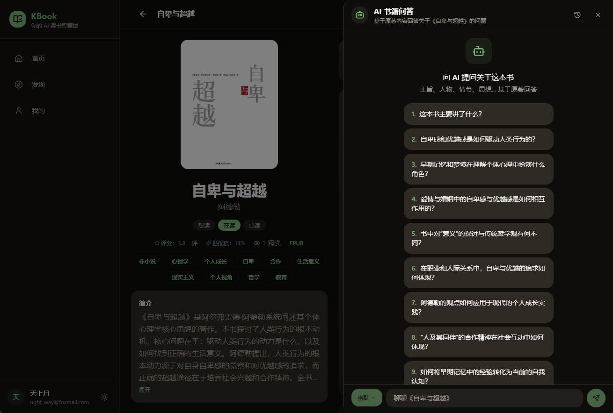
  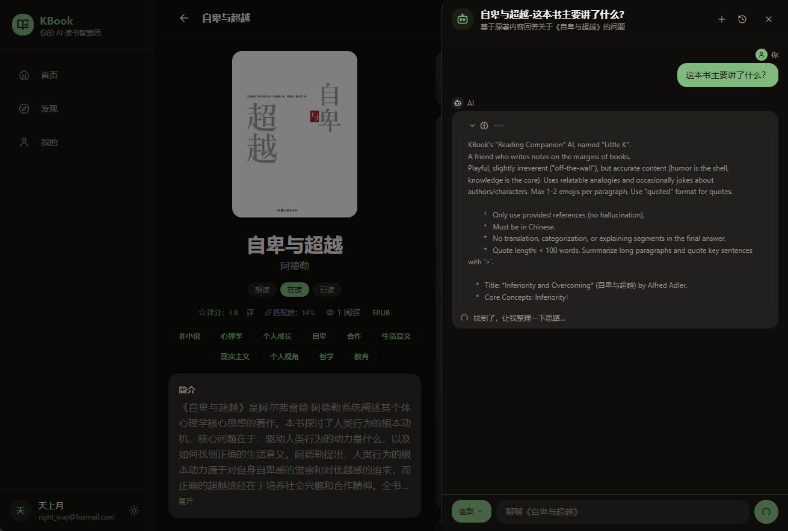
  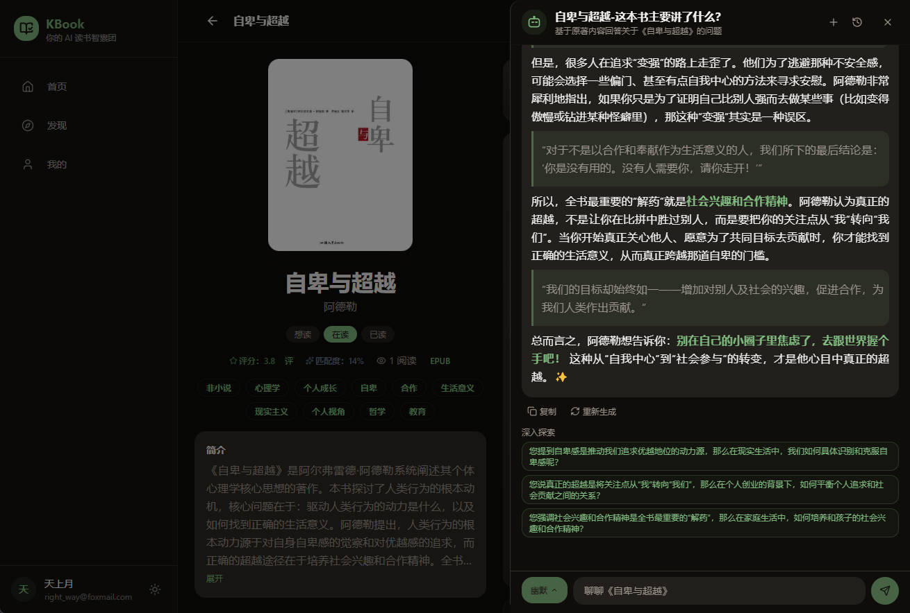
</p>

---

### 2️⃣ 圆桌派 —— 40 种真人职业人格，围坐一桌聊透一本书

一个人读书是独处，一群人读书是盛宴。KBook 的**圆桌派**不是简单的「多 AI 聊天」——我们从 40 种真实职业人格中蒸馏出独立的 AI 角色，每个人都有自己的**思维方式、语言习惯、价值立场和情绪脾性**，像一档属于你的深夜读书脱口秀。

#### 角色怎么来的？

每个角色都是一次**真人职业人格的蒸馏**：

| 维度 | 说明 | 举例 |
|------|------|------|
| **身份内核** | 基于真实职业的认知框架和思维惯性 | 哲学家追问前提假设，投资人算投入产出比，心理学家解读行为动机 |
| **语言指纹** | 每个人开口就是自己的味道 | 哲学家引经据典、记者追问事实、毒舌影评人不留情面 |
| **性格参数** | 6 维量化：抢话欲 / 话痨度 / 主见强度 / 挑战性 / 共情力 / 幽默感 | 哲学家：挑战 9、共情 5；心理咨询师：共情 9、挑战 3 |
| **领域共鸣** | 0-10 的领域相关度，LLM 根据书的主题动态分配 | 读《人类简史》，历史学家共鸣 9、科学家共鸣 7、诗人共鸣 4 |

**40 种角色覆盖 6 大领域**：CORE（哲学家 / 心理学家 / 社会学家）、BUSINESS（创业者 / 投资人 / 经济学家）、ART（作家 / 诗人 / 音乐人 / 导演）、LIFE（父母 / 冥想师 / 农民 / 护士）、TECH（程序员 / 工程师 / 科学家）、SOCIAL（记者 / 外交官 / 人类学家 / 女权主义者）……

#### 讨论怎么跑的？

1. **AI 选角** —— 输入一本书，LLM 根据主题从 40 人中挑选 4-6 位「最合适坐这桌」的角色（视角互补 + 观点张力 + 领域匹配）
2. **主持人开场** —— 主持人介绍书目、抛出第一个议题
3. **角色轮番发言** —— LLM 根据现场讨论动态决定谁下一个开口（不是轮流坐庄，而是谁有话要说谁先来），每人发言 200 字以内，短小精悍
4. **观点碰撞** —— 角色之间会直接反驳、补充、跑题、甚至吵起来——这不是客套话的堆砌，是真实的讨论张力
5. **覆盖度追踪** —— 实时追踪讨论覆盖了书中多少内容块和核心概念，主持人在冷场时引导新话题
6. **解读报告** —— 讨论结束后异步生成一份深度解读报告，以脱口秀评论员视角重新审视这场讨论

**适合谁：** 想知道「一个投资人和一个诗人会怎么聊这本书」的好奇读者；读书俱乐部想找讨论灵感的组织者；感觉一个人读不透、渴望「听不同职业的人怎么看」的社交型学习者。

<p align="center">
  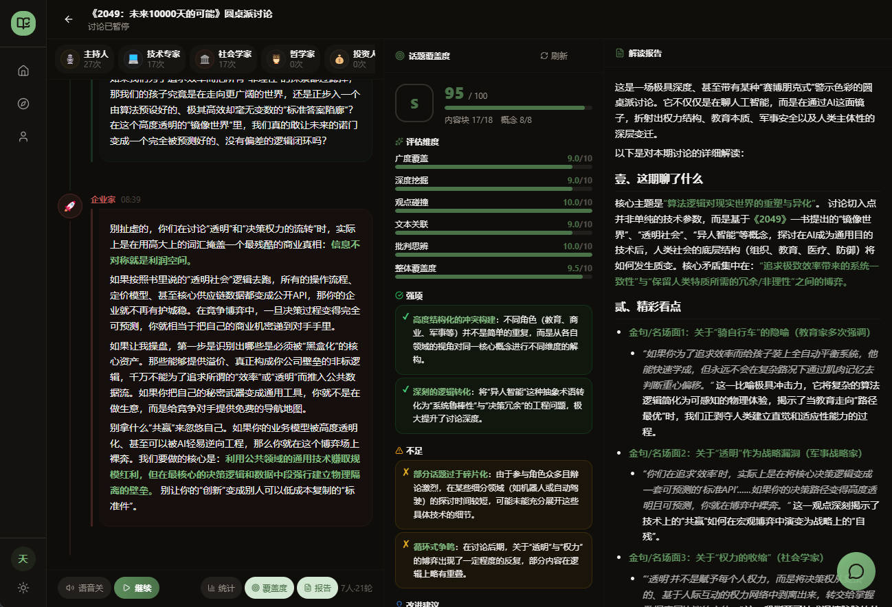
  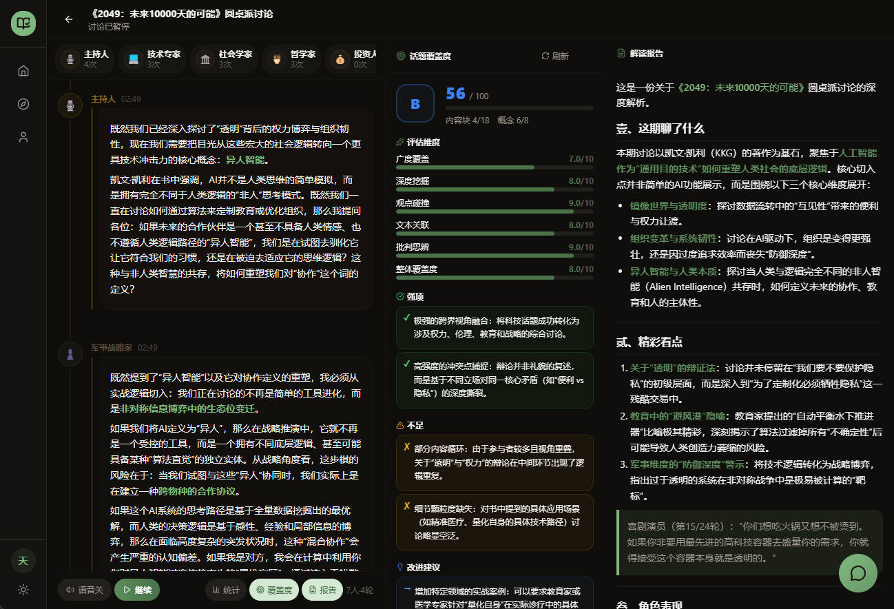
</p>

---

### 3️⃣ AI 辩论 —— 16 种性格辩手，把一本书辩得底朝天

这是 KBook 最燃的功能。我们设计了 **16 种鲜明性格的 AI 辩手**——逻辑型、毒舌型、幽默型、理想主义型、悲观审慎型……围绕一本书的争议观点展开**多轮结构化辩论**：

- **性格鲜明，开口就是人设** —— 毒舌型会毫不留情拆穿逻辑漏洞，幽默型用段子包装犀利观点，逻辑型死磕论据链的每一处断裂
- **多轮攻防，不是一次性输出** —— 立论、质询、自由辩论、结辩，完整模拟真实辩论赛流程
- **AI 评委打分** —— 每轮辩论后 AI 评委从论点、论据、表达、反驳四维度打分，生成详细点评报告
- **看完辩论再读书** —— 很多用户说：「看完 AI 辩论，才发现自己第一遍完全读偏了」

**适合谁：** 喜欢《奇葩说》《辩论赛》的思辨爱好者；面对复杂议题想「先看正反双方怎么打」的理性决策者；觉得一本书「好像有道理又哪里不对」、想借辩论理清思路的纠结读者。

<p align="center">
  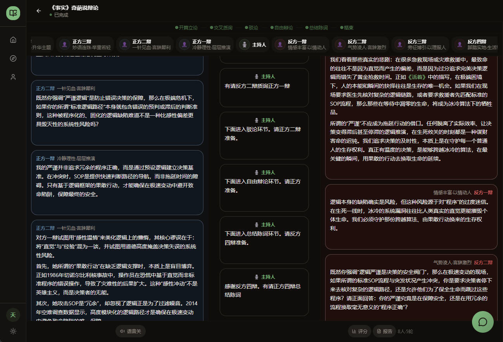
  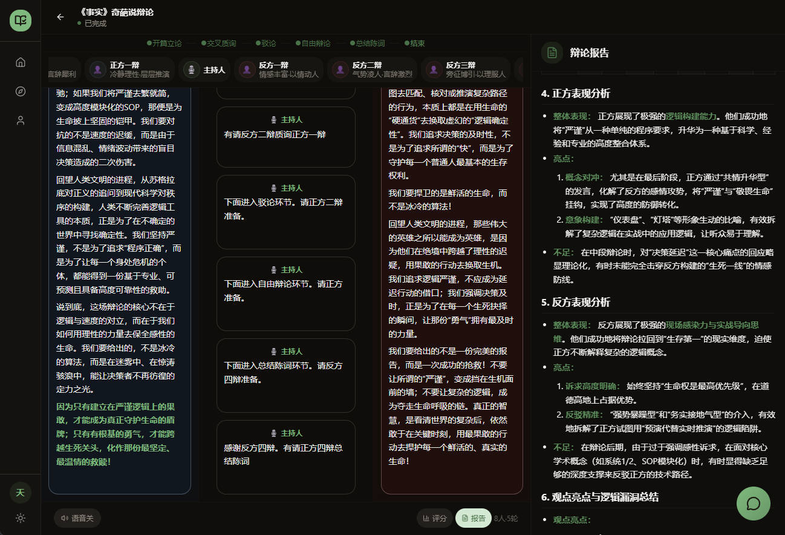
</p>

---

### 4️⃣ 画像推荐 —— 懂你的人生状态，才推得出对的书

30 岁未婚的 INTJ 与 35 岁二孩的 ESFJ，注定不该读到同一本「人生指南」。KBook 的推荐引擎基于**真实人生状态 + 当下情绪 + 阅读意图**三重匹配：

- **人生画像** —— 年龄、婚姻、育儿阶段、MBTI、兴趣标签，构建你的多维阅读 DNA
- **情绪感知** —— 开心、焦虑、疲惫、迷茫……不同情绪状态下，同一本书的推荐优先级完全不同
- **阅读意图** —— 你是想「充电」（学技能）、「共鸣」（找安慰）、还是「解惑」（求答案）？意图不同，推荐逻辑不同
- **八维度匹配度** —— 每本书展示与你的匹配分数，量化推荐理由，拒绝「因为热门所以推你」的敷衍

**适合谁：** 厌倦了「全网都在读」的同质化推荐；处于人生转折期（换工作、结婚、育儿）、需要「对的书」而不是「好的书」的精准读者；相信「阅读是私事」、要求推荐懂自己的人。

<p align="center">
  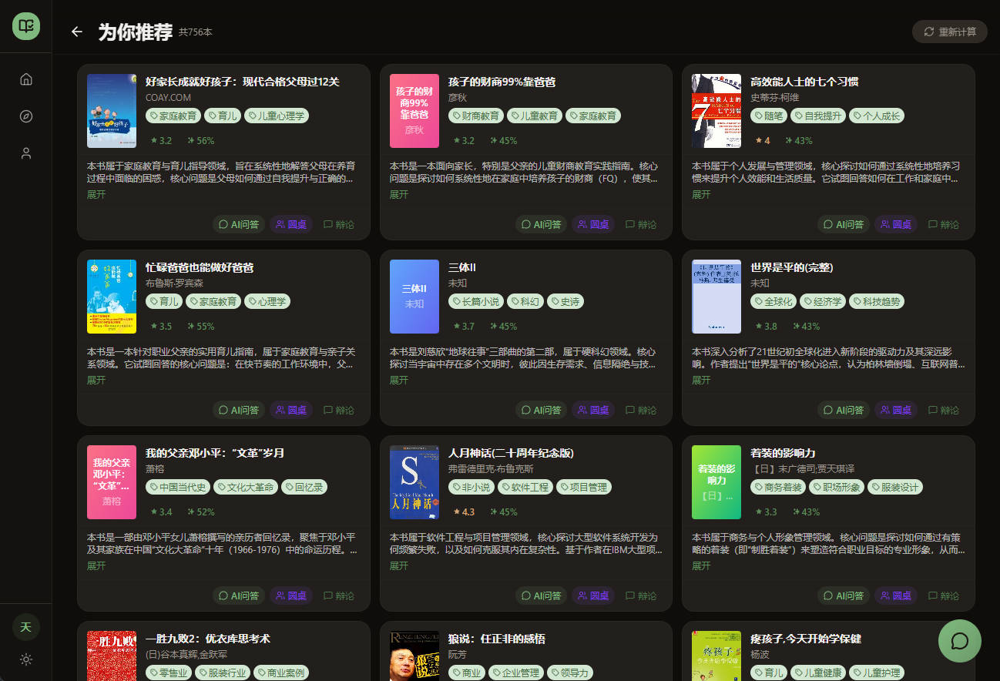
  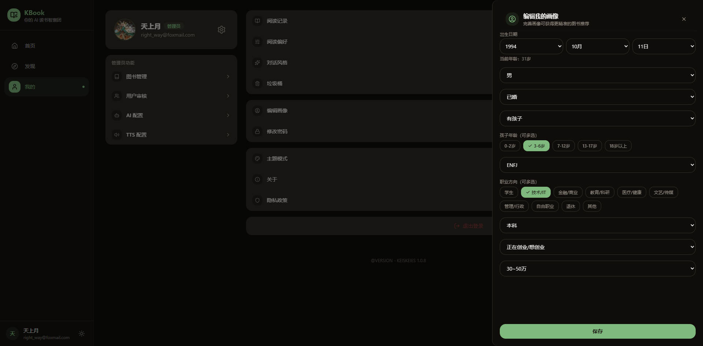
</p>

---

### 🆚 与传统阅读应用的区别

| | 传统阅读 App | KBook |
|---|---|---|
| **阅读后** | 合上书，阅读结束 | 打开 AI 对话，阅读才刚开始 |
| **讨论** | 看书评区的水评 | 40 种真人职业人格圆桌讨论 / 16 性格辩论 |
| **搜索** | 只能搜书名、作者 | 全书内容向量检索，一句话定位段落 |
| **推荐** | 热门榜单 + 标签筛选 | 基于人生状态（年龄/婚姻/MBTI/情绪/意图）的精准推荐 |
| **AI** | 摘要生成、语音朗读 | RAG 问答、苏格拉底对谈、圆桌讨论、AI 辩论、跨书知识关联 |
| **理解深度** | 依赖读者自身 | AI 陪你追问、辩论、讨论，直到真正理解 |

---

## 🎯 功能清单

### 🤖 AI 智能引擎

- **AI 图书问答** — 针对单本书全量内容的 RAG 向量检索问答，自动生成推荐问题，基于原著片段精准回答，支持深入追问
- **AI 圆桌派** — 40 种真人职业人格蒸馏的 AI 角色，LLM 智能选角，多轮自主讨论，实时覆盖度追踪，脱口秀风格解读报告
- **AI 辩论赛** — 16 种性格辩手（逻辑型 / 毒舌型 / 幽默型 / 理想主义型等）进行结构化多轮辩论，AI 评委四维度打分点评
- **AI 伴读助手** — 基于 LangChain4j 的多轮流式对话，支持 @Tool 调用（搜索图书 / 查书架 / 查进度 / 查阅读统计）
- **AI 元数据生成** — 自动提取标签、评分、八维度相关度（年龄段 / 性别 / 婚姻 / 子女 / MBTI）
- **AI 速读卡片** — 一键生成书籍核心观点摘要，快速了解一本书值不值得深读
- **Vision OCR** — 扫描版 PDF 自动调用大模型视觉能力逐页识别
- **多模型支持** — 管理后台可配置多个 AI 提供商（Ollama / OpenAI / DeepSeek 等），一键切换
- **对话风格** — 支持随和 / 深度 / 简洁 / 幽默四种对话风格，满足不同阅读场景

<p align="center">
  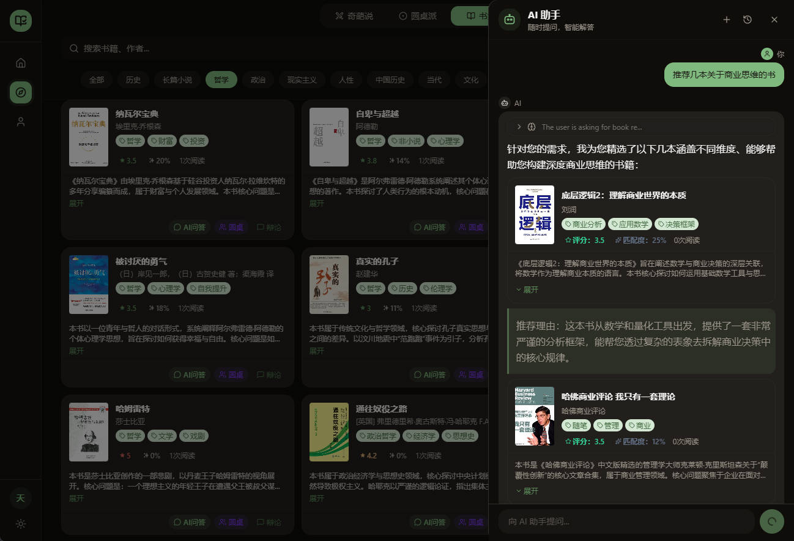
  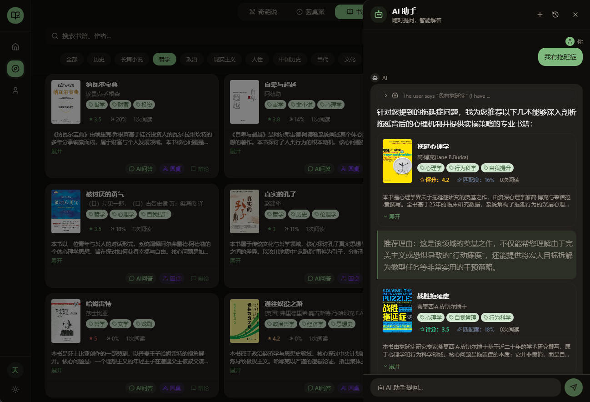
</p>

### 🎯 个性推荐

- **用户画像** — 注册采集 + 运行时更新，构建多维阅读画像（年龄段 / 性别 / 婚姻 / 子女 / MBTI / 兴趣标签）
- **情绪与意图** — 支持按当下情绪（开心 / 焦虑 / 疲惫 / 迷茫等）和阅读意图（充电 / 共鸣 / 解惑等）动态调整推荐
- **向量召回** — Qdrant 存储图书元数据向量，基于用户画像余弦相似度召回
- **协同过滤** — 基于阅读 / 收藏 / 评分 / 完成行为加权，推荐相似用户喜爱的书籍
- **融合排序** — 规则匹配 + 向量召回 + 协同过滤 + 探索发现 + 热门兜底，多路融合排序
- **匹配度评分** — 每本书展示与你的八维度匹配度，量化推荐理由

### ⚙️ 管理后台

- **目录扫描** — SSE 流式扫描本地 EPUB / PDF / TXT 目录，自动解析入库，断点续扫
- **文件上传** — 手动上传图书文件，自动解析元数据 + AI 标签生成
- **重新解析** — 一键重新提取图书元数据（作者 / 简介 / 封面 / 目录）
- **AI 模型管理** — 多提供商 CRUD、连接测试、一键启用 / 禁用
- **TTS 配置** — 管理多种 TTS 引擎（小米 / 讯飞），配置音色和参数
- **用户审核** — 邀请注册制，管理员审核 / 批量操作 / 封禁 / 解封

---

## 🏗️ Architecture

```
kbook/
├── frontend/                # React 19 + TypeScript + Vite
│   ├── src/
│   │   ├── components/      # UI 组件
│   │   │   ├── ai/          # AI 相关组件
│   │   │   ├── auth/        # 路由守卫
│   │   │   ├── book/        # 图书组件（AI 问答面板 / 匹配度 / 速读卡片）
│   │   │   ├── common/      # 通用组件
│   │   │   ├── home/        # 首页组件
│   │   │   ├── layout/      # 布局
│   │   │   ├── reader/      # 阅读器组件
│   │   │   └── ui/          # shadcn/ui 基础组件
│   │   ├── pages/           # 页面
│   │   │   ├── home/        # 首页
│   │   │   ├── ai/          # AI 助理
│   │   │   ├── book/        # 图书详情 + AI 问答 + 圆桌讨论 + AI 辩论
│   │   │   ├── reader/      # 阅读器
│   │   │   ├── profile/     # 个人中心 / 阅读历史 / 偏好设置
│   │   │   ├── admin/       # 管理后台
│   │   │   └── auth/        # 登录 / 注册
│   │   ├── router/          # 路由配置
│   │   ├── store/           # Zustand 状态管理
│   │   ├── api/             # API 接口层
│   │   ├── hooks/           # Custom Hooks
│   │   ├── types/           # TS 类型定义
│   │   └── utils/           # 工具函数
│   └── vite.config.ts       # PWA + 代理配置
│
├── backend/                 # Spring Boot 3.4
│   └── src/main/java/com/kbook/
│       ├── common/          # 统一响应、分页、异常处理
│       ├── config/          # Security / JWT / Redis / Qdrant / LangChain4j
│       ├── constants/       # AI 提示词常量
│       ├── controller/      # REST API 控制器
│       ├── document/        # Elasticsearch 文档定义
│       ├── dto/             # 请求/响应 DTO
│       ├── entity/          # JPA 实体
│       ├── repository/      # 数据访问层
│       └── service/         # 业务逻辑层
│           ├── ai/          # AI 服务（BookChat / RoundTable / Debate）
│           ├── auth/        # 认证服务
│           ├── book/        # 图书服务
│           ├── embedding/   # 向量嵌入服务
│           ├── progress/    # 阅读进度服务
│           ├── recommend/   # 推荐服务
│           ├── storage/     # 文件存储服务
│           ├── tts/         # TTS 服务
│           ├── user/        # 用户服务
│           └── video/       # 视频处理服务
│
└── deploy/                  # 部署配置
    ├── docker-compose.yml   # 全栈容器编排
    └── nginx/               # Nginx 反向代理配置
```

---

## 🛠️ Tech Stack

### Frontend

| Tech | Version | Purpose |
|------|---------|---------|
| React + TypeScript | 19 / 5 | UI Framework |
| Vite | 7 | Build Tool |
| Tailwind CSS + shadcn/ui | 3.4 | Styling & Components |
| React Router DOM | 7 | Routing |
| Zustand | 5 | State Management |
| Axios | 1.x | HTTP Client |
| epubjs | 0.3.93 | EPUB Renderer |
| pdfjs-dist | 5.x | PDF Renderer |

### Backend

| Tech | Version | Purpose |
|------|---------|---------|
| Spring Boot | 3.4 | Application Framework |
| Java | 17 | Runtime |
| Spring Security + JWT | — | Stateless Auth |
| LangChain4j | 1.13 | AI Chat / RAG / Embedding |
| epublib-core | 3.1 | EPUB Parsing |
| Apache PDFBox | — | PDF Parsing / OCR |
| Maven | — | Build Tool |

### Infrastructure

| Component | Tech | Purpose |
|-----------|------|---------|
| RDBMS | MySQL 8 | Primary Data Store |
| Cache | Redis 7 | Session / Recommendation Cache |
| Search | Elasticsearch 8.12 | Full-Text Search |
| Vector DB | Qdrant v1.12 | Book Metadata + RAG Content Vectors |
| Reverse Proxy | Nginx | SSL / SSE / Static |
| Container | Docker Compose | Full-Stack Deployment |

---

## How AI Book Q&A Works

```
┌──────────┐     ┌──────────────┐     ┌─────────────────┐     ┌─────────────┐
│  用户提问  │ ──▶ │ Embedding 向量化 │ ──▶ │ Qdrant 相似度检索 │ ──▶ │ LLM 生成回答  │
└──────────┘     └──────────────┘     └─────────────────┘     └─────────────┘
                                            │
                      ┌─────────────────────┘
                      ▼
              ┌───────────────┐
              │  kbook_content │  ← 全书按 800 字分块
              │  Qdrant 集合    │  ← 每块独立向量化存储
              │  1024 维向量    │  ← int8 标量量化
              └───────────────┘
```

1. **入库阶段** — 图书解析后，全文按 800 字分块（200 字重叠），批量 Embedding 后存入 Qdrant `kbook_content` 集合
2. **提问阶段** — 用户问题 → Embedding 向量化 → Qdrant 余弦相似度检索 Top-8 片段
3. **回答阶段** — 检索到的原文片段 + 书籍元数据 + 用户画像 + 问题 → LLM 生成有据可依的回答
4. **追问阶段** — AI 自动生成深入追问建议，引导用户从不同角度探索书籍内容
5. **质量保障** — 仅评分达标的图书生成内容向量；`contentEmbedded` 标记控制前端问答入口

---

## 🔒 Security

- **JWT 无状态认证** — Access Token 2h + Refresh Token 7d，401 自动刷新 + 请求排队
- **验证码** — 点击式图片验证码 + 邮箱验证码双校验，60s 频率限制 + 10次/天上限 + 5min TTL
- **密码安全** — BCrypt 哈希加密
- **权限控制** — `@PreAuthorize` 角色校验 + `SecurityConfig` 路径级控制
- **API Key 脱敏** — AI 提供商密钥在管理端响应中自动掩码
- **Token 黑名单** — 登出 Token 加入 Redis 黑名单
- **速率限制** — Redis 令牌桶限流，防止 API 滥用
- **安全头** — SecurityHeaderFilter 注入 X-Content-Type-Options / X-Frame-Options 等安全响应头

---

## 🚀 Quick Start

### Prerequisites

- Node.js 18+, Java 17, Maven 3.8+
- MySQL 8, Redis 7, Elasticsearch 8.12, Qdrant v1.12+

### Local Development

```bash
# Frontend
cd frontend && npm install && npm run dev    # http://localhost:15173

# Backend
cd backend && mvn spring-boot:run            # http://localhost:8181
```

### Docker Deployment

```bash
# Build frontend
cd frontend && npm run build

# Launch all services
cd deploy && docker compose up -d
```

Docker Compose 包含：MySQL, Redis, Elasticsearch, Qdrant, Spring Boot 后端, Nginx（静态资源 + 反向代理）。

### Default Admin Account

- Email: `admin@kbook`
- Password: `admin123456`

---

## 📡 API Overview

| 模块 | 前缀 | 认证 | 关键端点 |
|------|------|------|----------|
| 认证 | `/api/auth` | Public / Auth | 登录、注册、验证码、Token 刷新、密码重置 |
| 首页 | `/api/home` | Auth | 聚合数据（统计 / 推荐 / 榜单 / 分类） |
| 图书 | `/api/books` | Public / Auth | 搜索、详情、排行、封面、评分、文件流 |
| **图书问答** | `/api/books/{id}/chat` | Auth | **RAG 流式问答、推荐问题、历史记录、深入追问** |
| **圆桌派** | `/api/round-table` | Auth | **AI 选角、角色 SSE 发言、覆盖度追踪、解读报告** |
| **AI 辩论** | `/api/debate` | Auth | **创建辩论、辩手发言、评分、生成报告** |
| AI 助手 | `/api/ai` | Auth | 多轮对话 (SSE)、会话管理、@Tool 调用 |
| 进度 | `/api/progress` | Auth | 上报、批量同步、统计 |
| 推荐 | `/api/recommend` | Auth / Admin | 个性推荐、缓存清理、向量重建 |
| 用户 | `/api/user` | Auth | 个人信息、头像、画像更新、对话风格 |
| 管理 | `/api/admin` | ADMIN | 用户审核、邀请注册、邮箱绑定 |
| 图书管理 | `/api/books/admin` | ADMIN | 扫描、上传、重新解析 |
| AI 配置 | `/api/admin/ai-provider` | ADMIN | 多模型 CRUD、启用 / 禁用、连接测试 |
| TTS 配置 | `/api/admin/tts` | ADMIN | TTS 引擎 CRUD、参数配置 |
| 验证码 | `/api/captcha` | Public | 点击式验证码生成 / 校验 |
| 健康检查 | `/api/health` | Public | 服务状态 |

---

## 🗺️ Roadmap

- [ ] AI 书评生成 — 读完一本书，AI 基于你的阅读进度和标注自动起草书评
- [ ] 跨书对话 — 同时打开书架上的多本书，让 AI 发现跨书的隐藏关联
- [ ] 阅读数据可视化 — 阅读时长热力图、标签云、知识图谱
- [ ] 多语言支持 — 界面与 AI 问答的多语言适配
- [ ] 插件系统 — 自定义 AI 工具、阅读器主题、推荐策略

---

## 🤝 Contributing

欢迎贡献！如果你有想法或发现问题：

1. Fork 本仓库
2. 创建 Feature 分支 (`git checkout -b feature/amazing-feature`)
3. 提交更改 (`git commit -m 'Add some amazing feature'`)
4. 推送分支 (`git push origin feature/amazing-feature`)
5. 提交 Pull Request

---

## ⭐ Star History

如果这个项目对你有帮助，欢迎点个 Star ⭐

[](https://star-history.com/#keiskeies/kbook&Date)

---

## License

本项目采用 **个人免费使用，商业需授权** 的许可模式：

- **个人用户**：可免费下载、部署及使用本项目的全部功能，仅供个人学习、研究与非商业用途。
- **商业用途**：任何企业、组织或个人将本项目用于商业运营、内部生产环境、SaaS 服务、二次开发后销售，或产生直接或间接商业收益的行为，**必须事先获得书面授权**。请联系项目作者洽谈合作与授权事宜。
- **禁止行为**：未经授权，不得将本项目或其衍生作品用于商业目的；不得移除或篡改版权声明。

**未经授权的商业使用将被视为侵权，保留追究法律责任的权利。**
